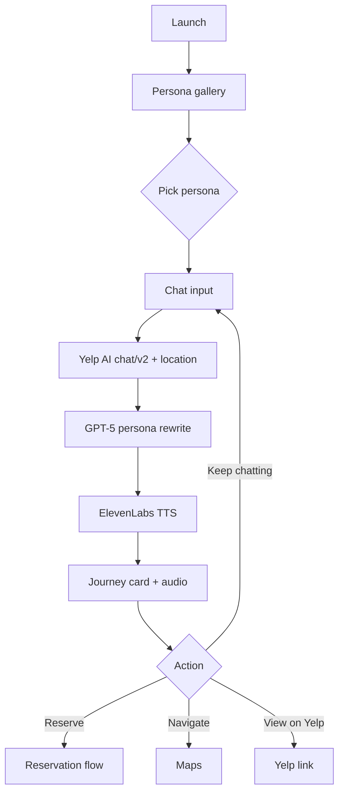

# Expo Implementation

Target: Expo iOS (TestFlight). Android optional later. Use **Expo SDK 54**.

## Setup
```bash
npx create-expo-app vibe-guide --template
cd vibe-guide
npx expo install expo-audio expo-file-system expo-location
npm install openai axios
npx expo start
```
Set `EXPO_PUBLIC_*` keys in `.env` and load via `app.config.ts`.

## User Journey


## Design Tokens
- Radius: 16px cards, 24px modals
- Blur: 12px backdrop on chat header and bottom sheet
- Motion: 120ms ease for taps, 200ms stagger on journey stops

## File Layout
```
app/
  index.tsx            // persona gallery
  chat/[persona].tsx   // chat + journey timeline
components/
  PersonaCard.tsx
  ChatBubble.tsx
  VoicePlayer.tsx
  BusinessCard.tsx
  JourneyTimeline.tsx
services/
  yelp.ts      // POST chat/v2 + chat_id persistence
  rewrite.ts   // provider switch (OpenAI default, Apple on-device optional)
  openai.ts    // OpenAI rewrite (4o-mini, timeout + fallback)
  voice.ts     // ElevenLabs TTS streaming + cache
constants/
  personas.ts  // persona prompts, voice IDs, avatars
  palette.ts
hooks/
  useLocation.ts
  useChat.ts
  useJourney.ts
```

## Core Flows
- Query path: `user input` → persona preface → Yelp AI → persona rewrite (OpenAI or Apple Foundation Models via `EXPO_PUBLIC_REWRITE_PROVIDER`) → TTS stream
- Store chat transcript locally; rehydrate on app resume to reuse `chat_id`
- Journey timeline built from `entities` with ETA heuristics by category

## Component Notes
- `PersonaCard`: color-coded, show quick actions ("Surprise me", "Impress someone")
- `VoicePlayer`: play/pause, replay cached clip, show waveform placeholder
- `BusinessCard`: name, rating, price, summary, snippet, CTA row

## Audio Tips
- Preload greeting clips to cover TTS spin-up (see `LATENCY_MASKING.md`)
- Cache last successful MP3 per persona; replay if fetch fails
- Ensure background audio permissions set for iOS

## Quick Ops
```bash
# Yelp AI smoke test
curl -X POST "https://api.yelp.com/ai/chat/v2" \
  -H "Authorization: Bearer $EXPO_PUBLIC_YELP_API_KEY" \
  -H "Content-Type: application/json" \
  -d '{"query":"Best date night spots in Manhattan","user_context":{"locale":"en_US","latitude":40.7128,"longitude":-74.0060}}'
```
Troubleshooting: 401 → bad key; 429 → retry with backoff; missing `contextual_info.summary` → use `summaries.short`.
